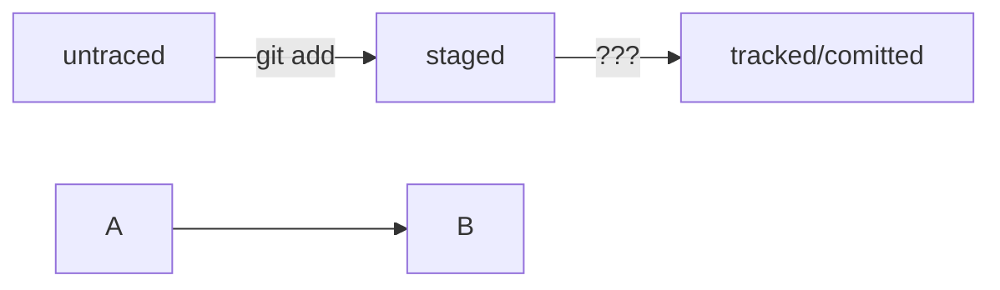

# Моя шпаргалка по Git.

## Шпаргалка разработанна совместно с Яндекс практикум.

### Расскажу в краце про commit остольное можно узнать из бесплатного курса.

**Чтобы сделать commit нужно выполнить три простые команды:**
* Сохранить файл с помощью комнды git add. 
* Выполнить commit с помощью команды git commit.
* И имопртировать проект в свой аккаунт github с помощью команды git push.

